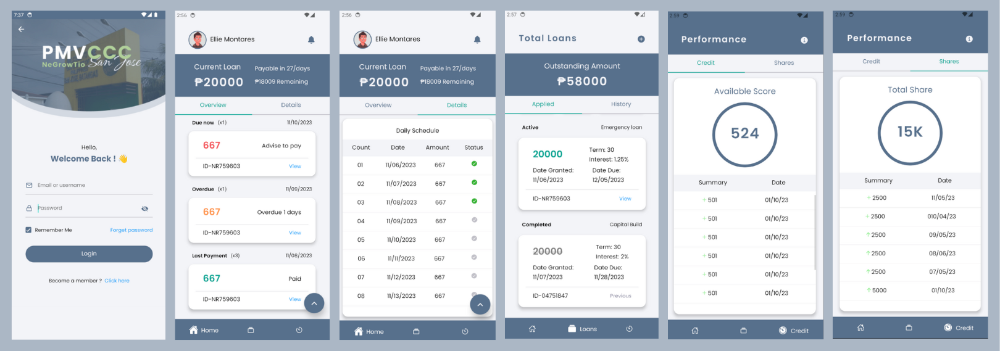

# TSJBPMVCCC Mobile Application

## Overview

NeGrowTio: A Lending Management System For The San Jose Batangas Public Market Vendors And Community Credit Cooperative. A borrower (vendors and community) application for monitoring and previewing loans and/or schedule of payments and share capital, tracking payments and histories, implementing creditworthiness scoring, using push notifications for updates and providing customer feedback for improvement.

See wesite appliation version [here](https://github.com/monrealljeriko/NGTApp-Admin)

## Preview

